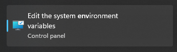
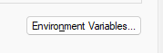
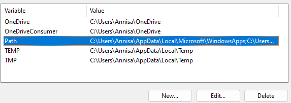
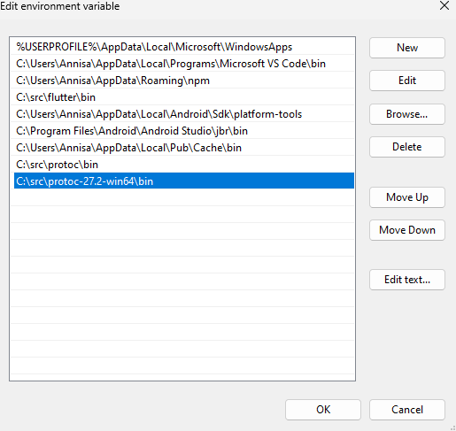
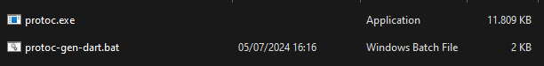

<div align=center>
<a href="https://nostracode.com">

</a>
</div>

<div align=center>
<p style="font-size: 26px; font-weight: bold;">NC Dart GRPC</p>
<p>Dart Project using GRPC</p>
</div>

---

## 📋 Table of Contents

- [Project Setup and Packages](#section_1)
- [Install Proto for Windows](#section_2)
- [Add Data and Protocol Buffers](#section_3)

## 🏷️ Project Setup and Packages <a name = "section_1"></a>

- Create project dart

  > dart create nc_dart_grpc

- Add dependencies

  ```yaml
  dependencies:
    path: ^1.8.0 # latest version
    protobuf: ^3.1.0 # latest version
    grpc: ^3.2.4 # latest version
  ```

- Install the relevant plugin for the platform we are targeting. In this case Dart. So, Run this command

  > dart pub global activate protoc_plugin

## 🏷️ Install Protoc for Windows <a name = "section_2"></a>

- <p align="justify">Download the specific release of protobuf for Windows. In my case the latest version was protoc-27.2. Remeber to download the asset for win32 or win64. </p> 
   <a href="https://github.com/protocolbuffers/protobuf/releases?source=post_page-----17493528e6a2--------------------------------">
   Click this link to download Releases Protocol Buffers/Protobuf
   </a>
  <br>
  <br>

- <p align="justify">Once the download from step above is done we can extract anywhere we’re comfortable and our system user has permission to read. In my case: C:\src\protoc-27.2-win64</p>
  <br>

- <p align="justify">Now we must add our extract file to our PATH in our system’s environment variables, including the subfolder “bin”. The complete path to add in my case is: “C:\src\protoc-27.2-win64\bin”. Follow these steps below</p>
  Open `Edit the system environment variables`
  <div >
  
  </div>
  <br>

  Click Environment Variables Button on the right button corner
  <div >
  
  </div>
  <br>

  Click Path then click Edit Button
  <div >
  
  </div>
  <br>

  Click `New` Button then add path, in my case is: “C:\src\protoc-27.2-win64\bin”. After that, click `OK`.
  <div >
  
  </div>
  <br>

- <p align="justify">After installing the protoc_plugin [step 1], it’ll add in our user’s folders a “protoc-gen-dart.bat” which we must copy and paste in the same bin folder we added to our path in the previous step. In my case the “protoc-gen-dart.bat” file is located in:

  `C:\Users\<YOUR_USER>\AppData\Local\Pub\Cache\bin`

  The final result must look like this: </p>
  <div>
   
   </div>
   <br>

## 🏷️ Add Data and Protocol Buffers <a name = "section_3"></a>

- Add `src/db.dart` under lib source and this contains the data we're going to be working with.

- Define a structure that represents those data structures we're going to be working with so that brings us to `protos/album.proto`. This is an example of a file that uses protocol buffer syntax.

- Generate dart data classes using protoc compiler. The command we're gonna run is:
  > protoc --dart_out=grpc:lib/src/generated -Iprotos protos/album.proto
